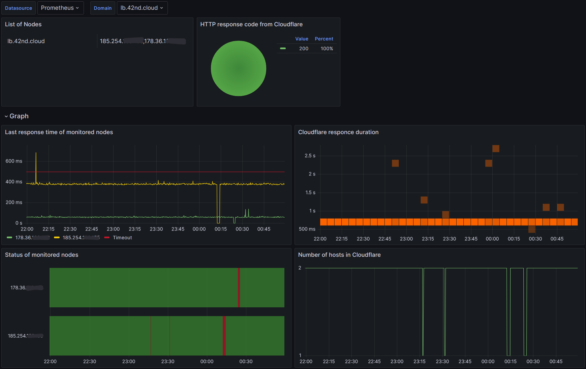

# CF-LB-Watcher

CF-LB-Watcher (Cloudflare Load Balancer Watcher) is a monitoring utility that keeps track of the health of your nodes (IPv4 and IPv6) and dynamically updates DNS records via Cloudflare's API.

## How It Works

- **Node Health Checks:** Periodically checks all nodes specified in NODES_V4 and NODES_V6[^1] using HTTP(S) requests.
- **DNS Record Updates:** If a node goes down, the corresponding DNS record is removed from Cloudflare. Once the node is back up and stable, the record is re-added.
- **Flapping Protection:** A flapping protection mechanism ensures that nodes that frequently change their state are not re-added to DNS too quickly.
- **Last node protection:** The last node will not be removed from DNS even if it is unavailable. Once the first available node appears, the record for the protected but unavailable node will be removed.
- **Prometheus Monitoring:** The utility runs a metrics server for Prometheus that provides insights into node statuses, response times, and DNS management statistics.

[](./grafana-dashboard/grafana-screenshot.png)

## Requirements

- Python 3.7+
- Cloudflare [API Token](https://developers.cloudflare.com/fundamentals/api/get-started/create-token/) with DNS edit permissions.
- One domain name.
- More than one node to monitor.
- Prometheus for monitoring metrics (optional).

## Environment Variables

To configure the utility, set the following environment variables (can be added to a `.env` file):

| Variable                        | Description                                                                 | Default      |
|----------------------------------|-----------------------------------------------------------------------------|--------------|
| `NODES_V4`                       | Comma-separated list of IPv4 addresses to monitor.                           | (required)   |
| `NODES_V6`[^1]                   | Comma-separated list of IPv6 addresses to monitor.                           | (required)   |
| `NODE_PROTOCOL`                  | Protocol used for health checks (`http` or `https`).                         | `http`       |
| `NODE_PORT`                      | Port number for health check requests.                                       | `80`         |
| `NODE_PATH`                      | Path for health checks (e.g., `/status`).                                    | `/status`    |
| `NODE_CHECK_TIMEOUT`             | Timeout for node health checks (in milliseconds).                            | `5000`       |
| `NODE_CHECK_INTERVAL`            | Interval between health checks (in seconds).                                 | `3`          |
| `CLOUDFLARE_API_TOKEN`           | Cloudflare API Token.                                                        | (required)   |
| `CLOUDFLARE_ZONE_ID`             | Cloudflare Zone ID.                                                          | (required)   |
| `CLOUDFLARE_DNS_RECORD_NAME`     | DNS record name to manage.                                                   | (required)   |
| `CLOUDFLARE_ENABLE_CF_PROXY`     | Whether to enable Cloudflare proxy (`true`/`false`).                         | `True`       |
| `CLOUDFLARE_DNS_TTL`             | TTL for Cloudflare DNS records (in seconds).                                 | `60`         |
| `CLOUDFLARE_REQUEST_TIMEOUT`     | Timeout for Cloudflare API requests (in seconds).                            | `10`         |
| `CLOUDFLARE_VALIDATION_INTERVAL` | Interval between DNS record validation checks (in seconds).                  | `60`         |
| `FLAPPING_PROTECTION_TIME`       | Time to wait before re-adding a node to DNS after flapping (in seconds).     | `30`         |
| `PROMETHEUS_PORT`                | Port on which the Prometheus metrics server runs.                            | `8080`       |
| `LOGGING_LEVEL`                  | Logging level (`DEBUG`, `INFO`, `WARNING`, `ERROR`).                         | `INFO`       |

## Prometheus Metrics

- `node_status` – Reports the status of monitored nodes (1 for UP, 0 for DOWN).
- `nodes_info` – Lists monitored nodes.
- `last_response_time` – Reports the last response time for each node.
- `node_check_timeout_seconds` – Reports the timeout setting for health checks.
- `cloudflare_dns_hosts_in_response` – Reports the number of DNS records in Cloudflare for your `CLOUDFLARE_DNS_RECORD_NAME`.
- `cloudflare_dns_request_duration_seconds` – Time taken for Cloudflare API requests.
- `cloudflare_dns_response_code` – last HTTP response code from Cloudflare API.
- `cloudflare_dns_record_name_info` – Tracks the Cloudflare DNS record name.

## Installation

1. Clone this repository:

    ```
    git clone https://github.com/aburdey08/CF-LB-Watcher.git
    ```
2. Install dependencies:

    ```
    pip install -r requirements.txt
    ```

3. Set up environment variables in a .env file or as system environment variables.
4. Start the utility:

    ```
    python cf_lb_watcher.py
    ```

Or just use [docker-compose](docker-compose.yml).

## P.S.:
The author is not a programmer — don’t know how to code :) But it works. The solution was implemented for a specific task in the way it was deemed necessary.
If you have any suggestions, comments, or improvements, you can create an Issue or a Pull request.

## Possible issues
[^1]: IPv6 support is theoretical. It hasn't been tested in practice!